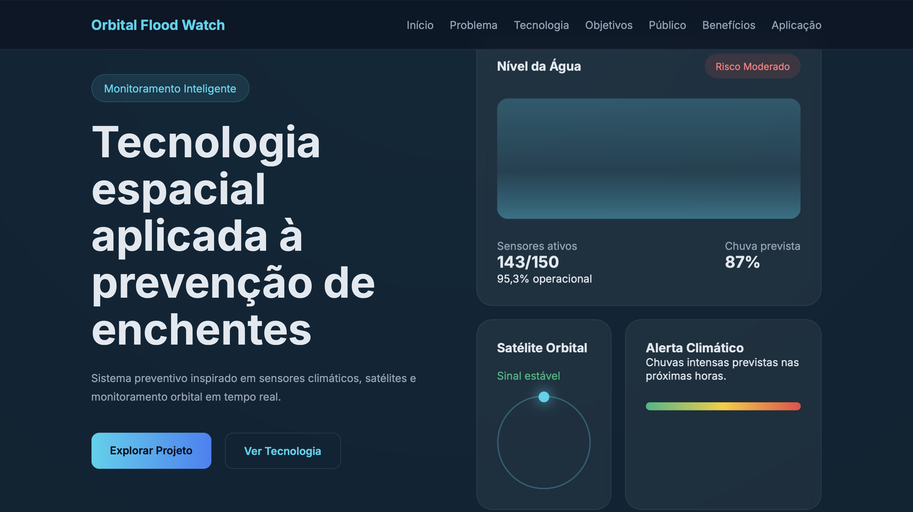
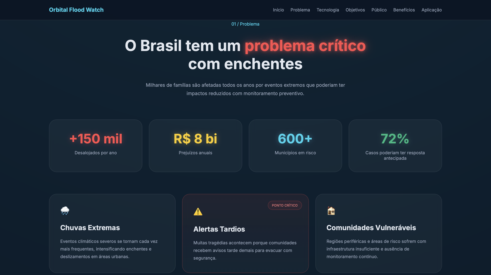
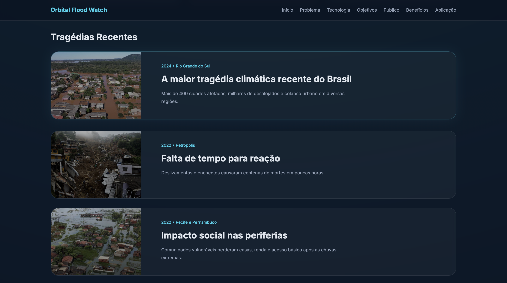
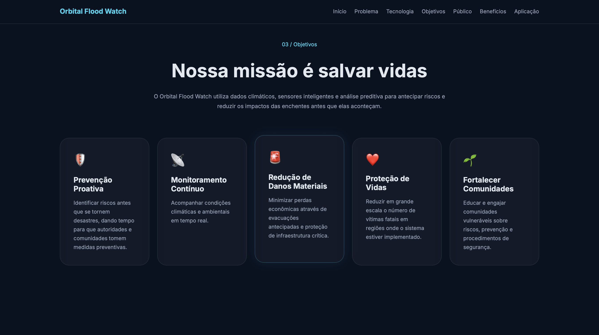
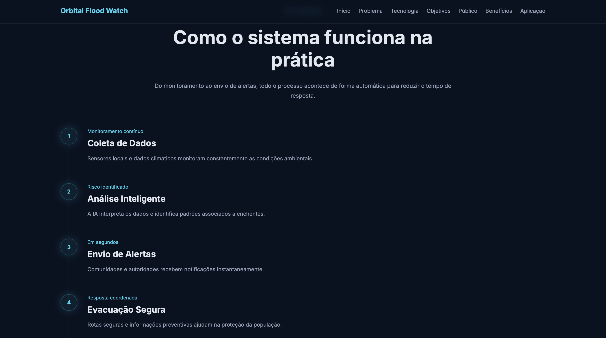
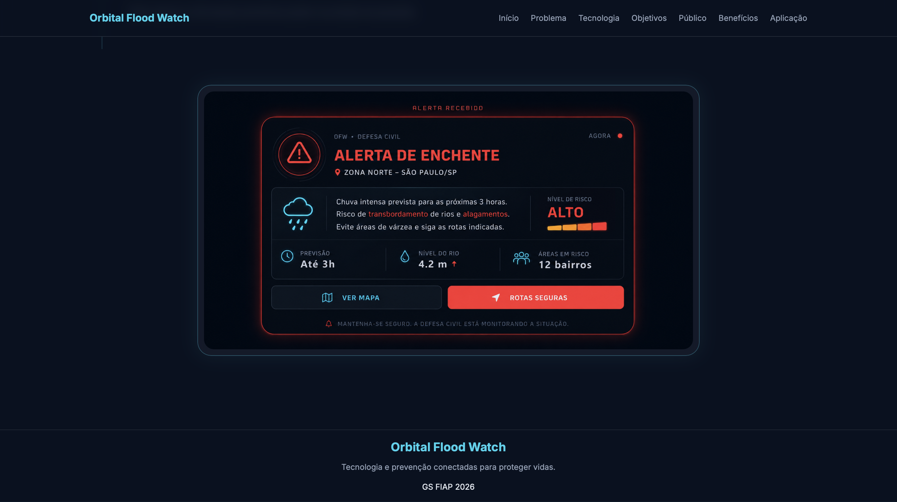

# 🌎 Orbital Flood Watch

Sistema inteligente de monitoramento climático e alerta preventivo para enchentes, inspirado em tecnologias espaciais, sensores ambientais e análise preditiva.

---

## 📖 Sobre o Projeto

O Orbital Flood Watch foi desenvolvido como proposta para a Global Solution FIAP 2026.

A solução busca reduzir os impactos causados por enchentes através do monitoramento contínuo de condições climáticas e ambientais, permitindo a emissão de alertas antecipados para comunidades vulneráveis e órgãos responsáveis.

---

## 🎯 O Problema

As enchentes representam um dos desastres naturais mais recorrentes no Brasil.

Todos os anos milhares de famílias são afetadas por:

- Alagamentos
- Deslizamentos
- Perdas materiais
- Interrupção de serviços essenciais
- Riscos à vida humana

Grande parte desses impactos poderia ser reduzida através de sistemas preventivos de monitoramento e alerta.

---

## 💡 Nossa Solução

O Orbital Flood Watch propõe um ecossistema integrado de prevenção composto por:

📡 Monitoramento climático inspirado em satélites

🌧️ Sensores ambientais para coleta de dados

🧠 Análise inteligente de riscos

🚨 Sistema de alertas preventivos

📱 Comunicação rápida com comunidades e autoridades

---

## ⚙️ Fluxo da Solução

```text
Monitoramento Climático
        ↓
Coleta de Dados
        ↓
Análise Inteligente
        ↓
Identificação de Risco
        ↓
Geração de Alertas
        ↓
Ação Preventiva
```
---

## 👥 Público-Alvo
### 🏘️ Comunidades Vulneráveis

Recebimento de alertas e orientações preventivas.

### 🚨 Defesa Civil

Monitoramento e coordenação de ações emergenciais.

### 🏛️ Órgãos Públicos

Planejamento urbano e gestão de riscos.

### 🔬 Pesquisadores

Análise de dados climáticos e ambientais.

---

## ✅ Benefícios
- Antecipação de riscos
- Redução de impactos sociais
- Maior tempo de resposta
- Apoio à tomadas de decisão
- Integração entre comunidade e órgãos públicos
- Fortalecimento da prevenção

---

## 🖼️ Demonstração

### 🚀 Interface Inicial

Tela principal do Orbital Flood Watch, apresentando a proposta de monitoramento inteligente baseado em sensores climáticos, análise preditiva e tecnologias inspiradas em sistemas espaciais. 



### 🌧️ O Problema - ⚠️ Tragédias Recentes

Milhares de famílias são afetadas anualmente por enchentes e deslizamentos. A plataforma destaca os principais desafios relacionados à prevenção e resposta a eventos climáticos extremos.

Eventos climáticos ocorridos nos últimos anos demonstram a necessidade de sistemas capazes de antecipar riscos e fornecer alertas preventivos à população para evitar ou ao menos minizar trágedias.




### 🎯 Objetivos

A solução busca antecipar riscos, reduzir impactos sociais e fortalecer a capacidade de resposta das comunidades vulneráveis por meio da tecnologia.



### ⚙️ Funcionamento

Fluxo operacional da solução, desde a coleta de dados ambientais até a emissão de alertas preventivos para comunidades e autoridades.



### 🚨 Alerta Preventivo

Exemplo de notificação enviada aos usuários quando o sistema identifica condições favoráveis para enchentes ou situações de risco iminente.



---

## 👨‍💻 Desenvolvido por
-
-
-
-

---
## 🌐 Deploy

GitHub Pages:
